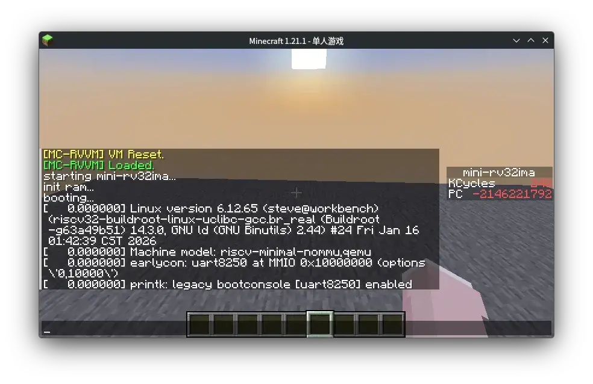

# ⛏️ MC-RVVM

[](LICENSE)
[](https://www.minecraft.net/)
[-orange.svg)](https://riscv.org/)

**English** | [简体中文](README_CN.md)



**MC-RVVM** is a powerful toolchain capable of statically transpiling **RISC-V (RV32IMA)** machine code into vanilla Minecraft datapacks. It's not just an emulator; it's a piece of "black magic" that allows binary programs to run at high speed indirectly within `.mcfunction` files.

<details>
<summary><b>How it Works (Principles)</b></summary>

MC-RVVM works by statically transpiling RISC-V machine code (ELF/bin) into Minecraft `.mcfunction` files.

1.  **Memory Simulation**: Uses `scoreboard` and `storage` to simulate 32-bit registers and RAM.
2.  **Instruction Dispatch**: A binary search tree (BST) is generated to efficiently jump to the correct instruction function based on the Program Counter (PC).
3.  **Block Optimization**: Sequential instructions are merged into single function blocks to minimize the dispatch overhead, significantly improving performance.

</details>

Want to run the **Linux Kernel** inside Minecraft? Or play **Doom** written in C? MC-RVVM makes all of this possible with pure vanilla support—no mods required.

## ✨ Core Features

- **⚡ Static Transpilation**: Pre-compiles ELF files into tree-based Minecraft functions, drastically reducing runtime overhead.
- **🚀 Block Optimization**: Automatically identifies hot code and performs instruction block optimization, significantly reducing dispatch depth and improving efficiency (use `--optimize`).
- **📺 GPU Rendering Engine**: Features high-speed rendering based on `text_display`, supporting 48x40 resolution output.
- **💤 Atomic Sleep**: Full support for `sleep` system calls, allowing you to pause for a specified duration or pause the execution of subsequent instructions.
- **🔧 Full Architecture Support**: Perfectly supports the standard RV32IMA instruction set.
- **🐧 Run Linux**: Includes a port of `mini-rv32ima`, allowing you to boot Linux 6.x kernels in-game (it's slow to boot, but it's a real Linux kernel!).
- **🚀 Fast Addressing**: Features unique instruction folding and binary search optimization, significantly boosting execution speed.
- **💻 Excellent I/O**: Implements reliable UART output to the chat bar and supports basic data interaction.
- **📦 Out of the Box**: Supports Minecraft 1.21+ (Datapack format 48).

## 🛠️ Requirements

To build this project, you will need the following tools:

1.  **Python 3.x**: For running the core transpiler and generation scripts.
2.  **RISC-V Toolchain**: Required for compiling C code.
    *   Ubuntu/Debian: `sudo apt install gcc-riscv64-unknown-elf`
3.  **Device Tree Compiler (dtc)**: Required for compiling `mini-rv32ima` and its device tree.
    *   Ubuntu/Debian: `sudo apt install device-tree-compiler`
4.  **Minecraft Java Edition**: 1.21 or higher (1.21.1 recommended).

## 🚀 Performance Optimization (Advanced)

This project supports accelerating code execution using GCC's `Os` flag. Since the bottleneck in MC function execution is often the binary search jumps for addressing, **reducing code size (`Os`) often yields better performance than traditional speed optimization (`O3`).**

Global optimization is now fully supported and **highly recommended**. Using `-Os` along with `-ffunction-sections` and `-fdata-sections` allows the transpiler to better handle code structure and improve addressing efficiency.

> [!TIP]
> **Why Os?**
> In Minecraft, the Program Counter (PC) jump is implemented via a deep binary search tree of functions. Smaller binary size means fewer "pages" and shallower jump depth, which directly translates to higher instructions per tick (IPT).

## 🏁 Quick Start

### 1. Clone the Repository
```bash
git clone https://github.com/Steve3184/MC-RVVM.git
cd MC-RVVM
```

### 2. Compile Examples
The `examples/` directory contains various examples for different purposes.

<details open>
<summary><b>Available Examples List</b></summary>

#### **A. Linux Emulator (`examples/mini-rv32ima`)**
A complete RISC-V emulator capable of booting Linux.
- **Speed**: ~980 instructions/s (Guest).
- **Boot Time**: ~3 mins to first kmsg, ~9 hours for full boot.
- **Note**: Only early kernel output is visible; UART output after `init` is currently unavailable.
```bash
make -C examples/mini-rv32ima
```

#### **B. 3D Rendering (`examples/3d`, `examples/fast3d`)**
Various 3D rendering demos including a cube, maze, and ray tracing (RTX).
```bash
make -C examples/3d
# or for the optimized version
make -C examples/fast3d
```

#### **C. Prime Test (`examples/prime`)**
Stress test calculating primes up to 10,000.
```bash
make -C examples/prime
```

#### **D. Basic Tests (`examples/rvvm_test`, `examples/vm_baretest`)**
- `rvvm_test`: Basic instruction set verification.
- `vm_baretest`: Bare-metal VM test (recommended for quick VM testing without Linux boot times).
```bash
make -C examples/rvvm_test
make -C examples/vm_baretest
```

#### **E. Screen/Display (`examples/screen`)**
Tests for the display rendering engine.
```bash
make -C examples/screen
```

</details>

### 3. Install to Minecraft
1.  The generated `rv_datapack` folder is your datapack.
2.  Copy it to your save's `datapacks/` directory:
    `~/.minecraft/saves/<Your_Save>/datapacks/`
3.  Enter the game and run `/datapack enable xxx`.
4.  Seeing the green `[MC-RVVM] Loaded.` message indicates success.

## 🔨 Compiling Your Own Programs

To compile your own C programs, you must use specific GCC flags to ensure compatibility:

**Required GCC Flags:**
`-march=rv32ima -mabi=ilp32 -nostdlib -fno-builtin -fno-stack-protector -fno-jump-tables`

**Required Linker Files:**
You must copy `linker.ld` and `crt0.s` from the `examples/common` directory to your project folder and link them; otherwise, the program will not boot correctly.

**Example Makefile:**
```makefile
CC = riscv32-unknown-elf-gcc
OBJCOPY = riscv32-unknown-elf-objcopy
PYTHON = python3

CFLAGS = -march=rv32ima -mabi=ilp32 -nostdlib -fno-builtin -fno-stack-protector -ffunction-sections -fdata-sections -fno-jump-tables -I. -Os
LDSCRIPT = linker.ld
CRT0 = crt0.s

MAIN_PY = src/main.py
DATAPACK_DIR = rv_datapack

TARGET = my_program

all: $(TARGET).bin transpile

$(TARGET).elf: $(TARGET).c $(CRT0)
	$(CC) $(CFLAGS) -Wl,-Map=$(TARGET).map -T $(LDSCRIPT) $(CRT0) $(TARGET).c -o $@

$(TARGET).bin: $(TARGET).elf
	$(OBJCOPY) -O binary $< $@

transpile: $(TARGET).bin
	$(PYTHON) $(MAIN_PY) $< $(DATAPACK_DIR) --map_file $(TARGET).map -O

clean:
	rm -f *.elf *.bin *.map
```

**Transpiler Arguments (`src/main.py`):**

- `usage: main.py [-h] [--namespace NAMESPACE] [--map_file MAP_FILE] [--optimize] [--ipt IPT] input_file output_dir`
- `input_file`: Path to the binary file (.bin) or hex dump.
- `output_dir`: Output directory for the datapack.
- `--namespace`: Datapack namespace (Default: `rv32`).
- `--optimize` / `-O`: Enables Block Optimization, significantly boosting speed for complex programs.
- `--ipt`: Sets instructions per tick (Default: 2500, Max: 3200).
- `--map_file`: Specifies the GCC-generated `.map` file to let the Block Optimizer identify function boundaries.

## 🎮 In-Game Operations

- **Reset/Start**: `/function rv32:reset`
- **Dump All Registers**: `/function rv32:debug/dump_inline`
- **Manual Tick**: `/function rv32:tick` (Runs automatically under normal conditions)

### Running Linux
If you compiled the full `mini-rv32ima` and want to try booting Linux:
1.  Download the kernel image [linux-6.8-rc1-rv32nommu-cnl-1.zip](https://github.com/cnlohr/mini-rv32ima-images/raw/refs/heads/master/images/linux-6.8-rc1-rv32nommu-cnl-1.zip) and extract `Image`.
2.  Import the kernel using the tool:
    ```bash
    python3 img2mc.py Image rv_datapack/data/rv32/function/load_extra_data.mcfunction rv32
    ```
3.  Start the VM: `/function rv32:reset`
4.  **Note**: Booting Linux takes a very long time (depending on your single-core CPU performance). Please be patient.

## 📂 Project Structure

- `src/`: Core transpiler files.
- `examples/`:
    - `rvvm_test`: Basic instruction tests.
    - `mini-rv32ima`: Complete RISC-V VM implementation.
    - `vm_baretest`: Virtual kernel for VM testing.
    - `prime`: Prime calculation stress test.
    - `common`: Contains `ld` config and built-in library implementations.
- `img2mc.py`: Tool for importing large files/kernel images.
- `rv_datapack/`: The final generated datapack.

## 📄 License

[MIT LICENSE](LICENSE)